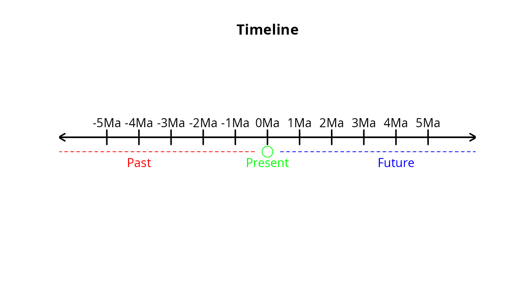

# 6. Time in gen3sis2

## 1. Introduction

Eco-evolutionary processes take place across space and time. For this
reason, time is also an important aspect of eco-evolutionary mechanistic
models. There are many approaches to dealing with time (including
constraints and rates) in ecology and evolution. In `gen3sis2`, time is
particularly important when defining spaces and configuration files. In
this vignette, we will see how to properly handle and make time explicit
in `gen3sis2` simulations.

## 2. Time in `gen3sis2`

### 2.1 Time and time units: what is accepted?

`gen3sis2` is an interdisciplinary project that can be used as a tool
across many fields. In addition, depending on the scope of the
experiment and/or the organism being modeled, the simulation can operate
on different time scales. This complexity, combined with the variety of
ways time is measured across scientific disciplines, can sometimes make
it difficult to compare experiments.

To promote standardization and reproducibility, `gen3sis2` accepts only
four time units: a (annum), ka (kilo-annum), Ma (mega-annum), and Ga
(giga-annum). In addition to these, `gen3sis2` also supports the
flag-unit “timestep”, which will be explained later.

The choice of these four accepted time units is meant to strategically
cover a wide range of possible temporal scales. Time in `gen3sis2` is
based on $`a`$, which is equivalent to one year, and the remaining units
are powers of ten of $`a`$. See the table below:

| time unit | *a* equivalent    | power of ten |
|-----------|-------------------|--------------|
| *a*       | 1 *a*             | $`10^0`$*a*  |
| *ka*      | 1,000 *a*         | $`10^3`$*a*  |
| *Ma*      | 1,000,000 *a*     | $`10^6`$*a*  |
| *Ga*      | 1,000,000,000 *a* | $`10^9`$*a*  |

In `gen3sis2`, time is conceptualized as a number line. Negative values
represent the past, zero represents the present, and positive values
represent the future.

For example, if a simulation starts five million years ago and ends five
million years in the future, we would say that it starts at
$`-5\text{Ma}`$ and ends at $`5\text{Ma}`$.

Visually, this situation can be represented by the following image:



### 2.2 Time and time-steps: how to deal with time in gen3sis_space\_ objects

When creating your spaces, the function `create_spaces_raster` requires
the `duration` parameter. This parameter must be provided as a list in
the format `list(from, to, by, unit)`.

The interpretation of the first two elements is straightforward: `from`
defines when the environmental data starts, and `to` defines when it
ends. The period between these two points in time is divided into equal
intervals, known as *time-steps*. The `by` element of `duration`
determines the length of each time-step, i.e., how much time is covered
by each step, given the selected unit. Finally, `unit` specifies the
time unit used (and therefore the time scale) and must be one of the
accepted options: a, ka, Ma, or Ga.

This list format is intentionally similar to the base R function
`seq(from, to, by)` and works in the same way.

The time-step is the backbone of a `gen3sis2` simulation, because each
process (dispersal, ecology, evolution, etc.) is simulated once per time
step. In other words, the simulation is initialized at the first
time-step and progresses sequentially until the last. Consequently, all
metrics and simulation outputs are computed and reported based on these
time-steps.

Users should be aware that the number of time-steps is an important
modeling decision. For example, a simulation covering the period from
−100 Ma to 0 Ma with 10 time steps of 10 Ma would run the processes 11
times. On the other hand, using 20 time steps of 5 Ma would result in 21
simulation steps. Therefore, these two simulations may not produce the
same outcomes, especially when stochastic factors are involved.

Consider a space ranging from −5 Ma to 5 Ma (as described in the
previous section), with each time step comprising 1 Ma. The
corresponding function call would look like this:

``` r
create_spaces_raster(
  raster_list = your_environmental_rasters,
  cost_function = your_cost_function,
  output_directory = where_to_save_spaces.rds,
  duration = list(from = -5, to = 5, by = 1, unit = "Ma") # time is here
)
```

This will produce 11 time-steps:


### 2.3 Time and `step_time`: how to deal with time in config file

In the configuration file, time is defined using the variables
`step_time`, `start_time`, and `end_time`.

The `step_time` variable sets the time scale at which the described
processes take place. It must be provided as a list in the format
`list(x, unit)`, where `unit` is the chosen time unit and `x` is the
numerical base.

For example, if `step_time = list(x = 2.5, unit = "ka")`, this means
that the processes are designed to return the specified values every 2.5
ka (2,500 years). The relationship between this and the `by` element of
the space duration will be discussed in the next section. The variables
`start_time` and `end_time` define when the simulation should begin and
end, respectively. These can be numeric values or NA.

The time unit must always remain consistent across the configuration.
For example, if a simulation has
`step_time = list(x = 2.5, unit = "ka")` and is intended to run from −10
ka to −2 ka, then the variables should be defined as `start_time = -10`
and `end_time = -2`. `gen3sis2` will always assume that both
`start_time` and `end_time` are expressed in the same unit as
`step_time`.

If `start_time = NA`, the simulation will start at the earliest
available time step. If `end_time = NA`, it will end at the latest
available time step. If both are NA, the simulation will simply use all
available time steps in the defined space.

### 2.4 Time and simulation: how the pieces fit together

To enhance reproducibility and allow experimentation with different
configurations and spaces, `gen3sis2` allows the use of configuration
files and spaces that are not defined on the same time scale. For
example, it is possible to use a configuration with
`step_time = list(x = 500, unit = "ka")` together with a space
constructed using
`duration = list(from = -10, to = 0, by = 1, unit = "Ma")`. In this
case, the space has time-steps spaced every 2 Ma, meaning that processes
are simulated every 2 Ma, while the configuration assumes that processes
occur every 1 Ma.

To reconcile these differences, when `gen3sis2` reads the configuration
file to initialize and run the simulation, it goes through a process of
time interpretation. This process has two main objectives: (1) to
understand how time is defined in both the configuration file and the
space, and (2) to harmonize the time scales between them.

Not every process is time-dependent, but some are. Dispersal, for
instance, usually depends on time, i.e., a species can disperse farther
over longer periods. For dispersal, `gen3sis2` automatically scales the
returned values according to the time-step. For example, considering the
configuration and space described above, if the dispersal value returned
by the configuration is 500, the simulation assumes that this
corresponds to each 1 Ma. Since each time step in the space spans 2 Ma,
the value is automatically scaled to 1000 for each time-step. Similarly,
isolated populations accumulate genetic divergence over time. Therefore,
gen3sis2 also automatically scales the values obtained from the
`get_divergence_factor` function.

The scaling process is fully transparent through on-screen messages and
warnings. It is performed using a multiplier that indicates how many
times an event should occur within each time-step. This multiplier is
calculated as follows:

``` math

scale\_time = \frac{conv\_unit \cdot S_t}{C_t}
```
where

- $`S_t`$ is the time-step of the space,
- $`C_t`$ is the time-step of the config,
- $`conv\_unit`$ is the conversion factor expressing one unit of the
  space’s time unit in the config’s time unit,
- $`step\_time`$ is the resulting multiplier.

For example, consider the config and space described above, with
`step_time = list(x = 500, unit = "ka")` and
`duration = list(from = -10, to = 0, by = 1, unit = "Ma")`,
respectively. In this case, $`S_t = 1`$, $`C_t = 500`$, and since
$`1\text{Ma} = 1000\text{ka}`$, $`conv_unit = 1000`$. Therefore,

``` math

scale\_time = \frac{1000 \cdot 1}{500} = 2
```

This result indicates that config-defined events should occur twice per
space time-step.

The multiplier is accessible to users through the joker variable
`scale_time`, which is a simple numeric value available for any desired
operation. For example:

``` r
get_dispersal_values <- function(n, species, space, config) {
  
  values <- rweibull(n, shape = 1.5, scale = 133)*scale_time # values will be properly scaled
  
  return(values)
}
```

Users should *not* define this variable within the config file, as it
serves as a placeholder automatically replaced by
`config$user$scale_time` during the simulation. Its sole purpose is to
keep the code clean and concise. For instance, using
`config$user$scale_time` instead of `scale_time` will produce the same
result.

When `gen3sis2` detects the use of `scale_time` inside any of the
`get_dispersal_values` or `get_divergence_factor` functions, it
automatically deactivates internal scaling for that process. This means
that, if users prefer to handle time scaling manually (for example,
using custom functions), they can simply include `scale_time` anywhere
in their code:

``` r
get_dispersal_values <- function(n, species, space, config) {
  scale_time # no scaling will occur in this function
  
  values <- rweibull(n, shape = 1.5, scale = 133) 
  
  return(values)
}
```

For best-practice usage, it is recommended to call `scale_time` at the
beginning of the function body.

If the user wishes to deactivate time scaling entirely, it is possible
to set the config time unit to “timestep”. In this case, the config is
always interpreted as being in the same temporal framework as the
spaces. For example, using `step_time = list(x = 1, unit = "timestep")`
completely disables time scaling. When “timestep” is used as the time
unit:

- The value of `x` becomes irrelevant and is ignored.
- The `scale_time` multiplier is automatically set to 1.

This approach is useful when temporal consistency between config and
spaces is already ensured, or when users prefer to work with abstract,
step-based time rather than explicit chronological units.

### 2.5 Human and machine config

As said above, when the config file the used provided is read by
`gen3sis2` (in `run_simuation()` or
[`create_input_config()`](../reference/create_input_config.md)), it goes
trough a process of interpretation. In this processes, many aspects of
the config are adapted to ensure that the simulation will run without
problems. One central points is to replace the place-holder `scale_time`
by the callable `config$user$scale_time`. In addition to that, code
commentaries are removed, `gen3sis2` detects whether the user used
`scale_time` inside any of the main functions or not. Finally, the
adapted code is parsed and evaluated.

The file provided by the user is called in `gen3sis2` as “human config”.
After this code is parsed and evaluated, it produces a list `config`
that is stored internally during the simulation (and saved within the
simulation state). This is called the “machine config”. They essentially
carry the same information, but the machine config is interpreted,
adapted and easily accessed by the simulation (and the user, when
desired).

## 3. Conclusion

Time is an important aspect of eco-evolutionary simulations, and dealing
with it in `gen3sis2` is straight-forward. Every config file must be
written considering time, as well as every space created. Config and
space can have different timeframes, but in tis case `gen3sis2` will
calculate a multiplier and apply it to config’s processes, what can
generate distortions.
